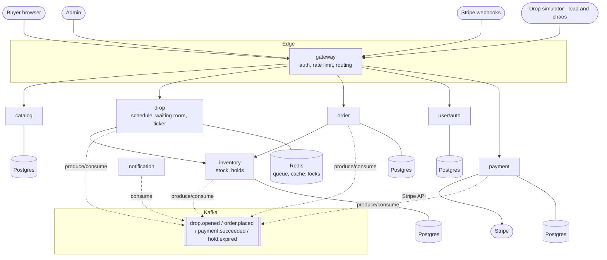

# Dropforge — High-Level Design

Living document, built section by section during Phase M0. Each section lands
after its lesson.

## 1. Requirements

### Functional
- Buyers: browse products; see upcoming drops with countdown; join the waiting
  room when a drop opens; receive a queue turn; hold an item; pay within the
  hold window (5 min); get notified of the outcome.
- Admins: create products; schedule drops (stock count, go-live time).

### Non-functional
- **Invariant (never breaks, even mid-crash): units sold ≤ units stocked.**
  Zero oversells — an oversell costs real refund money, not just UX.
- Fairness: waiting-room turns are first-come-first-served.
- Spike tolerance: survive the drop-open stampede without falling over.
- Bot resistance: one human ≈ one queue slot.
- SLO: join-queue p99 < 500 ms during peak; drop page p99 < 200 ms (cached).

## 2. Capacity estimates (flagship drop: 10,000 buyers, 100 items)

| Quantity | Estimate | Reasoning |
|---|---|---|
| Peak join rate | ~800 rps | 80% of 10k buyers click join within 10 s of open |
| Steady browse rate | ~5 rps | normal day; the spike is ~160× steady state |
| Successful orders | 100 per drop | stock is the ceiling — total write volume is tiny |
| Rejections | 9,900 per drop | 99% of buyers must lose; rejection must be the cheapest path |
| Live ticker connections | 10,000 concurrent WebSockets | connection state/memory, a separate axis from rps |
| Order storage | ~KBs per drop | storage is a non-problem |

### What bounds this system
Dropforge is **concurrency-bound**: the hard part is 10k simultaneous claims on
100 units, not data volume. Design consequences, in priority order:
1. Size for the spike, not the average (the waiting room absorbs it).
2. Keep the write path (reserve → hold → pay) tiny and protected.
3. Make rejection the cheapest operation in the system — losers never touch
   the database.

## 3. Context diagram



Every service also emits metrics/logs/traces to the observability stack
(Prometheus, Loki, Tempo) — omitted above for readability.

## 4. Service boundaries and their defense

**Rule: a service boundary is defined by the data it owns and the invariant it
protects — not by nouns in the problem statement.** Split where consistency
requirements change: atomic-together stays together; eventual-consistency may
be separated.

| Service | Owns | Why it is a separate service |
|---|---|---|
| inventory | stock counts, purchase holds | protects THE invariant (no oversell); highest-contention atomic writes. Holds live here because a held unit IS stock state — splitting that across services splits the invariant |
| order | order lifecycle records | write-light, history-heavy lifecycle tracking; no shared invariant with stock |
| catalog | products, prices | read-heavy, cacheable, staleness-tolerant — opposite consistency needs from inventory |
| drop | drop schedule, waiting-room queue, live ticker | traffic-shaping state (who may try, when), distinct from stock state (who succeeds) |
| payment | charges, Stripe integration | quarantines an external dependency, its failure modes, and its secrets |
| notification | delivery attempts | pure async consumer; nobody waits on it; failures isolate to a DLQ |
| user | identities, credentials, roles | identity is its own domain and security boundary |
| gateway | (no domain data) | edge concerns — authn enforcement, rate limiting, routing — implemented once, not seven times |

Deliberately absent: a cart service. Flash drops have no cart — the purchase
hold plays that role. A boundary drawn around a noun with no invariant behind
it is how distributed monoliths start.

## 5. API contracts

Services never touch each other's databases; they talk only through these
contracts, agreed here before implementation. All public routes go through the
gateway and require a JWT (except signup/login and Stripe's webhook).

### Public (buyer-facing)

| Method & path | Owner | Purpose | Success | Notable errors |
|---|---|---|---|---|
| GET /products, /products/{id} | catalog | browse | 200 | — |
| GET /drops/upcoming, /drops/{id} | drop | drop page + countdown | 200 (cacheable) | — |
| POST /drops/{id}/queue | drop | join the waiting room | 201 {queueToken, position} | 409 not open, 429 rate-limited |
| WS /drops/{id}/live | drop | position + stock ticker push | — | — |
| POST /orders | order | create order from a hold | 201 {orderId} | 410 hold expired |
| POST /orders/{id}/payment | payment | pay within the hold window | 201 {clientSecret} | 410 window closed |
| POST /webhooks/stripe | payment | Stripe confirms/fails a charge | 200 | signature check |
| POST /auth/signup, /auth/login | user | identity | 201/200 {tokens} | 401 |

### Internal: the reservation contract (the system's heart)

Called by drop when a buyer reaches the front of the queue. Inventory is the
single source of truth for stock; only this endpoint can claim a unit.

```
POST inventory:/internal/holds
{
  "dropId":         "d-12",
  "buyerId":        "u-4032",
  "idempotencyKey": "q-8f3a..."   // the buyer's queue token
}

201 Created  { "holdId": "h-991", "expiresAt": "20:04:31Z" }   // 5-min hold
409 Conflict { "reason": "SOLD_OUT" }                          // cheap rejection
200 OK       { ...same hold... }   // duplicate of an already-processed key
```

Rules the contract encodes:
- **Idempotent:** same idempotencyKey twice → the same hold once. Network
  retries can never claim two units for one buyer.
- **Atomic decrement:** grant the hold and decrease available stock in one
  database action — the invariant lives or dies on this line.
- **Expiry:** an unpaid hold lapses at expiresAt; the unit returns to the pool
  and `hold.expired` is published so drop can admit the next buyer.
- One hold per buyer per drop (fairness).
